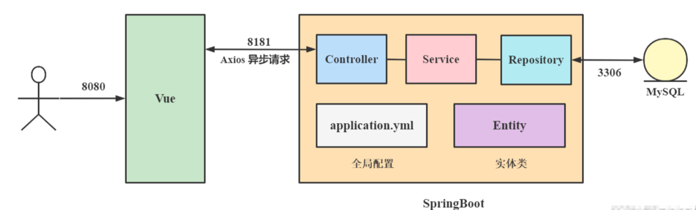
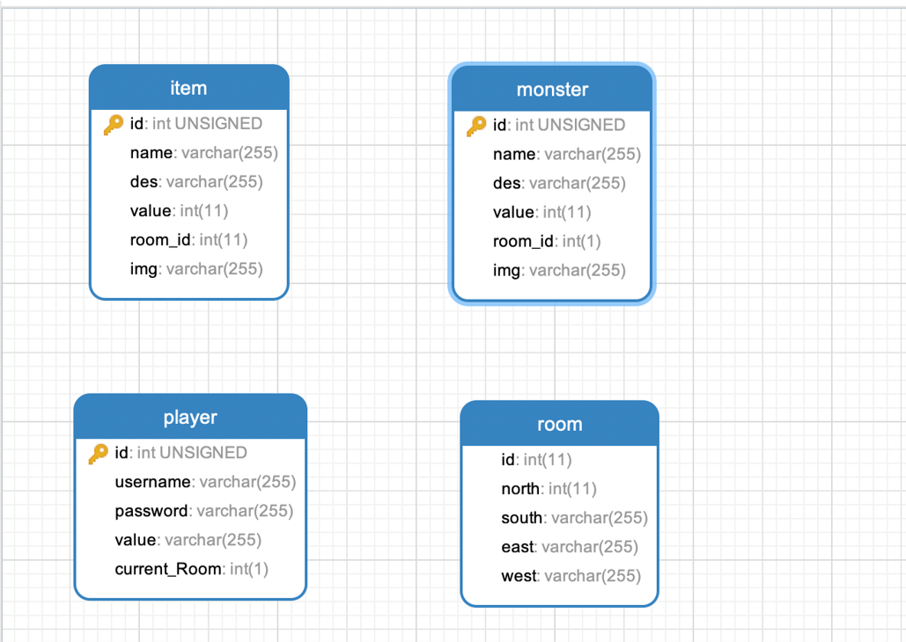
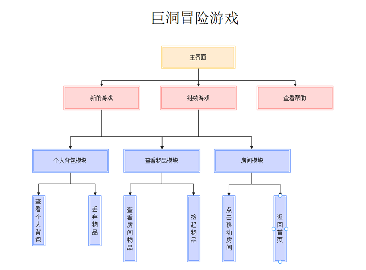
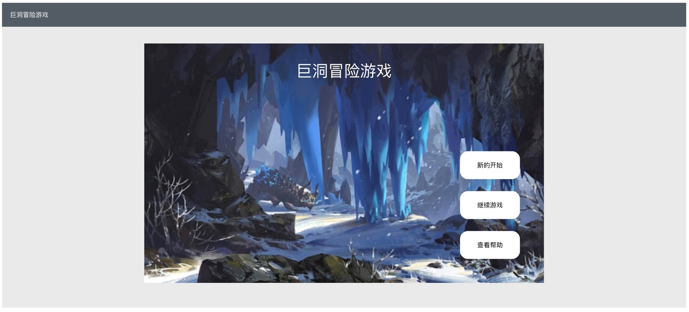
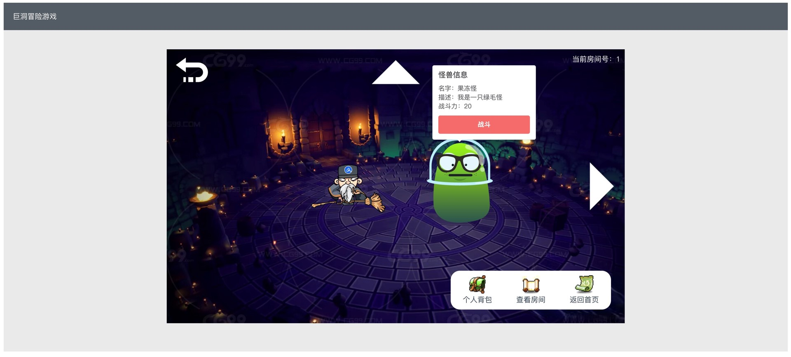
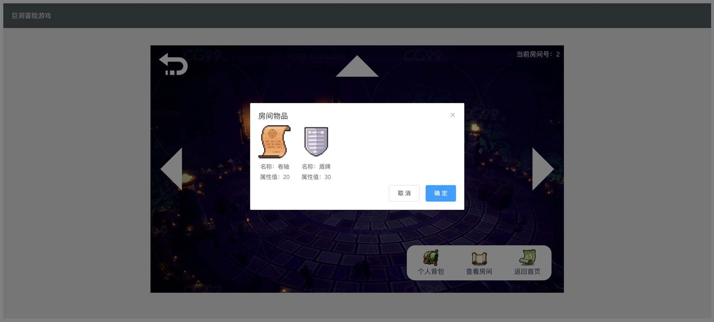
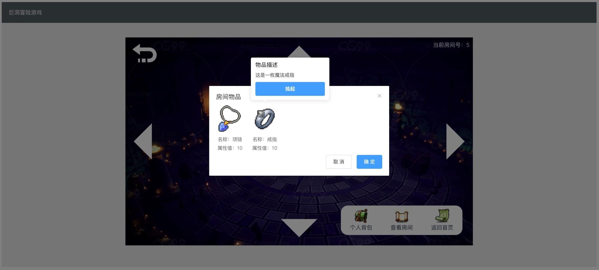
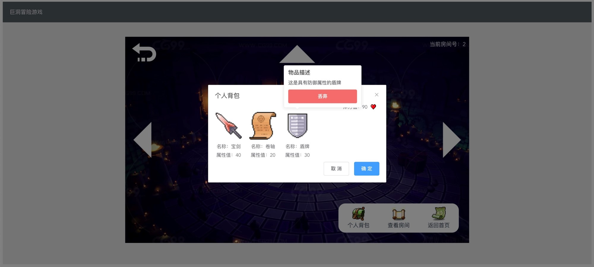
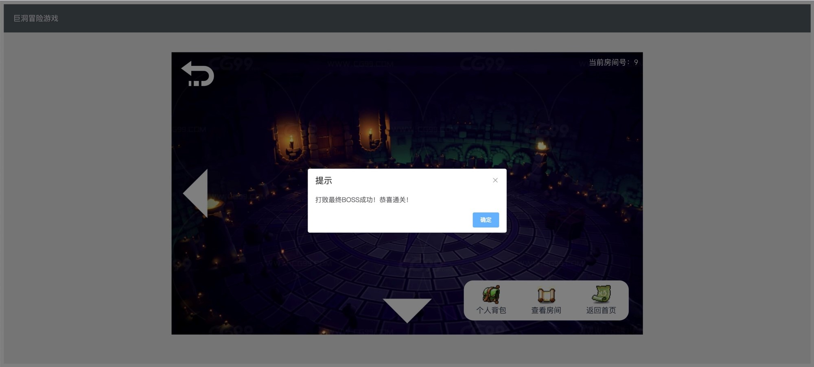

欢迎使用 **{小书匠}(xiaoshujiang)笔记软件**，您可以通过 `小书匠主按钮>模板` 里的模板管理来改变新建文章的内容。

----------
## 开发工具

 - 编译工具：IDEA
 - 前端：vue+elementUI
 - 后端：springboot+mysql

## 整体架构图
<i class="fas fa-sitemap"></i>**采用前后端分离架构**

## 数据库设计

## 功能结构图

## 游戏界面设计
### 游戏主界面

### 怪兽信息

### 查看房间

### 捡起物品

### 个人背包

### 通关提示

